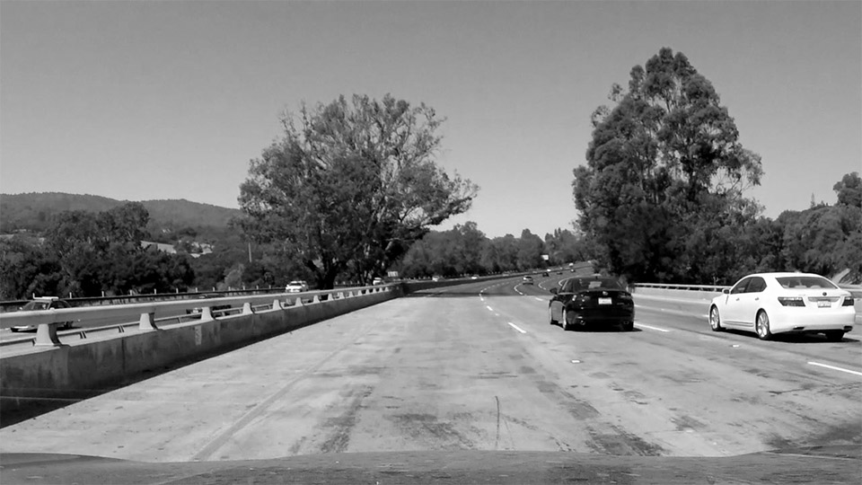
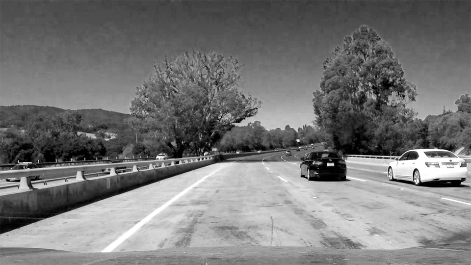

# **Finding Lane Lines on the Road**

**Finding Lane Lines on the Road**

The goals / steps of this project are the following:
* Make a pipeline that finds lane lines on the road
* Reflect on your work in a written report

[//]: # (Image References)

[image1]: ./examples/grayscale.jpg "Grayscale"
[challenge1]: ./writeup_images/challenge1.jpg "Challenge1"
[challenge2]: ./writeup_images/challenge2.jpg "Challenge1"
[challenge3]: ./writeup_images/challenge3.jpg "Challenge1"
[perspective]: ./writeup_images/perspective_adjustment.jpg "Perspective Adjustment"
---

### Reflection

### 1. Describe your pipeline. As part of the description, explain how you modified the draw_lines() function.

Working on this project I quickly realized that solving the static images and basic videos was a bunch easier than the challenge video. Therefore, I grabbed three of what seemed like the worst frames from the challenge video and included them in my static testing. These are the frames selected:

![alt text][challenge1]
![alt text][challenge2]
![alt text][challenge3]

My pipeline consisted of 11 steps:

1. *Convert to Grayscale*: Doing some research I learned that there are more than one grayscale conversion formulas and that the default conversions are usually designed so that the resulting image is pleasing to the human eye. A typical formula is Y=0.299R+0.587G+0.114B, where the R, G, and B contributions from each pixel are not equally considered. For this project, I set out to pick a formula that would be more pleasing to my lane detection algorithm and make the challenge video easier to deal with. After experimentation I found that picking Y=R (select the red channel), provided a great result and very meaningful improvement. Here are [Seven grayscale conversion algorithms](http://www.tannerhelland.com/3643/grayscale-image-algorithm-vb6/) with example images to help illustrate. See below what a difference this made to the yellow lane line on tan bridge:
    * **Photoshop's default grayscale conversion** 
    * **Photoshop's red filter grayscale conversion** 

1. *Gaussian blur*: Get rid of some noise, settled on `kernel_size=5`

1. *Canny transform*: Detect edges in the image, I used a `low_threshold=64` and `high_threshold=192`.

1. *Calculate mask trapezoid*: Important to get rid of as many edges detected in trees, the hills, other vehicles, etc. Critical! But, not a complete solution for focusing in on the lane lines, especially since videos may come from cameras located in varying positions recording the road. Another consideration was to be video/frame resolution agnostic when defining the mask.

1. *Hough transform*: This transform essentially joins multiple detected lines that are likely part of the same physical edge in the image, i.e. they are inline with each other, have small gaps breaking what should have been a single line into multiple segments, etc. For a variety of reasons, mostly due to noise, the Canny edge detection will not give you perfect results you might wish for, and Hough is required for making some sense of the situation.

1. *Split left and right lines*: I used a basic heuristic here. I picked a vertical mid line and split the list of lines into left and right collections by checking wither both end-points were on the left or right half of the frame.

1. *Reject mostly horizontal lines*: The challenge video include part of the vehicle's hood which reflected all sorts of shapes. Masking it out wasn't an option because I'd lose valuable data in other videos. I filtered out all lines with `-0.5 < slope < 0.5`, as well as infinite slope (vertical lines)

    *Perspective adjustment and line filtering (not used)*: Here I considered several algorithms in an attempt to reject any lines not "stacking up". My theory was that if I adjusted for image perspective it would be easier to further filter lines. The results didn't work out as well as I would have hoped, here's an example image of the masked region with the perspective backed out using a very simple trapezoidal to rectangular mapping. The tall red edges are actually a stack up of numerous shorter edge lines. Ultimately, I didn't utilize this approach.

    ![alt text][perspective]

1. *Single-frame line fitting/averaging*: I decided that longer lines had to carry more weight as that was information gleaned and calculated by the Hough transform that connected lines that were very likely part of longer edges in the image. So, I used a weighted average of the end-point coordinates with line-length as the weighting.

1. *Line extrapolation*: By this point I had a single line representative of the left lane, and a corresponding one for the right lane. I extrapolated them to the top and bottom edges of my original mask. This produced a nice result, when there were enough edges in a frame. In some cases though it was not possible to calculate a left or right lane line from a single frame, or, the detected edges were a bit too far ahead and the road had started curving. This last issue had the effect of making my predicted lines swing around a bit. To solve this, I:

1. *Multi-frame averaging*: I created a ring buffer to store the last 10 lane predictions for each lane. In each frame I calculated the extrapolated lane prediction, added it to the buffer, and then averaged the lot of them to get a final result. This eliminated a good amount of jitter and equally importantly, filled in a some frames where a lane prediction was not possible. Stuffing more frames into the buffer was a trade-off between jitter and delayed response when the actual lane line moved in the video. 10 frames seemed about right.

1. *Weighted-multi-frame averaging*: I made one last addition when I decided that frames that included longer detected edges should count for more than predicted lane lines from frames with little "signal". I updated my ring buffer to store the maximum edge line length from each frame, and then I used that information in a weighted average calculation of the 10 last frames.

### 2. Identify potential shortcomings with your current pipeline

One short-coming would be detecting cat-eyes that are used on some roads as lane markers. In some cases, such as the challenge video, the right lane uses cat-eyes when going over part of the bridge. This caused the problem of relying on longer edges that were further away. On a straight road this would be fine, however on a curved road, such as in the challenge video, this had a larger impact on the position of the single-frame predicted lane line.

Another shortcoming has to do with shadows from trees over the road surface.

### 3. Suggest possible improvements to your pipeline

1. One improvement would be to use more sophisticated and adaptive grayscale conversions. I would try segmenting the frame into a grid and applying local decisions with brightness and contrast settings, as well as maybe a different RGB mix to optimize the edge detection in each area of the frame.

1. I'd also develop an adaptive mask that would narrow down the area of eligible edge lines based on the currently predicted lane line. For instance, reject any detected edge lines that aren't parallel to the predicted lane line (whithin a margin) and are more than some number of pixels away. This approach would rely on the theory that there is continuity between frames.

1. I'd spend more time working on the parameters, maybe consider a way of scoring the results and then optimizing the parameter selection.

1. Lastly, while using 2 videos is fine, and 3 videos is better, collecting many additional videos in different conditions I am sure would reveal ways to make this algorithm more robust.